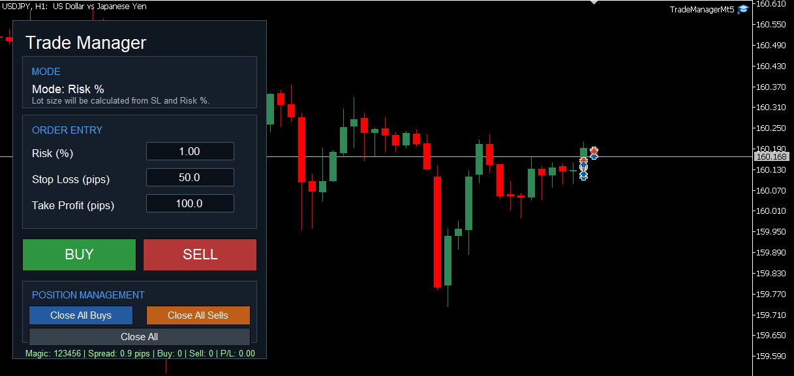
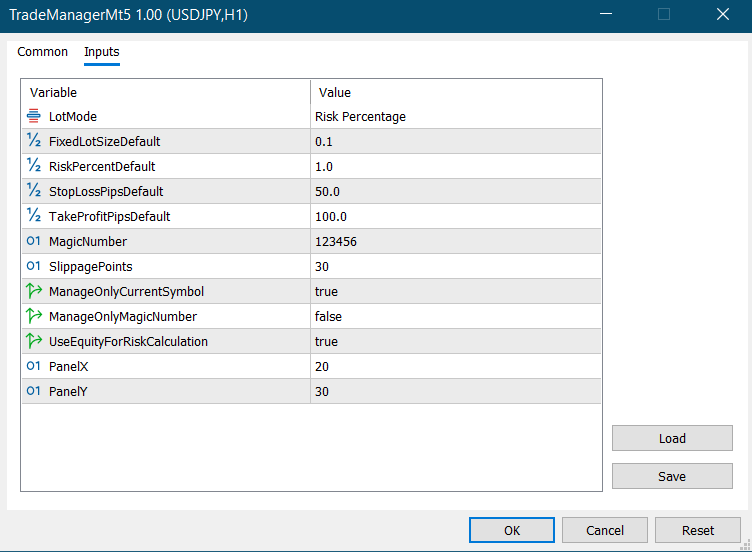

# MQL5 Trade Manager UI EA

A MetaTrader 5 Expert Advisor that provides a chart-based trade management panel for fast manual trading.

This EA is designed for traders who need quick order execution, especially scalpers and intraday traders. It allows users to open buy/sell trades, set stop loss and take profit in pips, use fixed lot or risk percentage mode, and close buy/sell/all positions directly from the chart.

> ⚠️ This project is for educational and portfolio demonstration purposes only. Trading involves risk. It is not financial advice and does not guarantee profitable results.

---

## Overview

MQL5 Trade Manager UI EA is a manual trading assistant for MetaTrader 5.

Instead of opening trades from the default MT5 order window, the user can trade from a clean on-chart panel. The panel includes editable input boxes, buy/sell buttons, close buttons, and a live status line showing spread, position count, and floating profit/loss.

This project demonstrates practical MQL5 skills including:

* Chart object UI development
* Button-based trade execution
* Edit box input handling
* Risk-based lot calculation
* Position filtering
* One-click trade management
* Real-time chart status updates
* MQL5 `CTrade` integration

---

## Key Features

* On-chart trading panel
* One-click Buy button
* One-click Sell button
* Close All Buys button
* Close All Sells button
* Close All positions button
* Editable lot/risk input box
* Editable stop loss input in pips
* Editable take profit input in pips
* Fixed lot mode
* Risk percentage mode
* Risk calculation using balance or equity
* Broker stop-level validation
* Magic number support
* Option to manage only current symbol
* Option to manage only positions with matching magic number
* Live spread display
* Live buy/sell position count
* Live floating profit/loss display
* Modern chart panel design using MQL5 objects

---

## Trading Modes

The EA supports two lot sizing modes.

### 1. Fixed Lot Mode

In fixed lot mode, the user enters the lot size directly in the panel.

Example:

```text
Lot Size = 0.10
```

When the Buy or Sell button is clicked, the EA opens the trade using the entered lot size.

---

### 2. Risk Percentage Mode

In risk percentage mode, the user enters a risk percentage instead of lot size.

Example:

```text
Risk (%) = 1.00
Stop Loss = 50 pips
```

The EA calculates the lot size based on:

* account balance or equity
* selected risk percentage
* stop loss distance
* symbol tick value
* broker lot limits

Risk percentage mode requires a valid stop loss value.

---

## Panel Controls

| Control               | Description                                      |
| --------------------- | ------------------------------------------------ |
| `BUY`                 | Opens a market buy trade                         |
| `SELL`                | Opens a market sell trade                        |
| `Lot Size / Risk (%)` | Main trade size input depending on selected mode |
| `Stop Loss (pips)`    | Stop loss distance from entry price              |
| `Take Profit (pips)`  | Take profit distance from entry price            |
| `Close All Buys`      | Closes all allowed buy positions                 |
| `Close All Sells`     | Closes all allowed sell positions                |
| `Close All`           | Closes all allowed buy and sell positions        |

---

## Input Parameters

| Input                         | Description                                                       |
| ----------------------------- | ----------------------------------------------------------------- |
| `LotMode`                     | Select fixed lot or risk percentage mode                          |
| `FixedLotSizeDefault`         | Default lot size shown in the panel                               |
| `RiskPercentDefault`          | Default risk percentage shown in the panel                        |
| `StopLossPipsDefault`         | Default stop loss value in pips                                   |
| `TakeProfitPipsDefault`       | Default take profit value in pips                                 |
| `MagicNumber`                 | Magic number used for trades opened by the EA                     |
| `SlippagePoints`              | Allowed slippage/deviation in points                              |
| `ManageOnlyCurrentSymbol`     | If true, close/manage only positions on the current chart symbol  |
| `ManageOnlyMagicNumber`       | If true, close/manage only positions matching the EA magic number |
| `UseEquityForRiskCalculation` | If true, risk lot calculation uses equity instead of balance      |
| `ShowTradeManagerPanel`       | Show or hide the chart panel                                      |
| `PanelX`                      | Panel horizontal position                                         |
| `PanelY`                      | Panel vertical position                                           |

---

## How It Works

When the EA is attached to a chart, it creates a trade management panel using MQL5 chart objects.

The user enters lot/risk, stop loss, and take profit values directly into the panel.

When the user clicks Buy or Sell:

1. The EA reads the values from the edit boxes.
2. It calculates the lot size.
3. It calculates stop loss and take profit price levels.
4. It validates broker minimum stop distance.
5. It sends the trade using MQL5 `CTrade`.

When the user clicks a close button:

1. The EA scans open positions.
2. It filters positions based on symbol and magic number settings.
3. It closes buy, sell, or all matching positions.

The status line updates automatically and shows spread, position count, and floating P/L.

---

## Best Use Case

This EA is useful for:

* Scalping
* Fast manual trading
* Intraday trading
* One-click trade execution
* Quick position closing
* Risk-controlled manual entries
* MQL5 chart UI demonstration

It is not an automatic trading strategy. It is a manual trade management tool.

---

## Screenshots

### Trade Manager Panel




### Input Settings



---

## Installation

1. Download `TradeManagerUI.mq5`.
2. Open MetaTrader 5.
3. Go to:

```text
File > Open Data Folder > MQL5 > Experts
```

4. Copy `TradeManagerUI.mq5` into the `Experts` folder.
5. Restart MetaTrader 5 or refresh the Navigator panel.
6. Attach the EA to a chart.
7. Enable Algo Trading.
8. Set the lot mode and panel settings from the EA inputs.

---

## Important Notes

* This EA opens market trades only.
* It does not open pending orders.
* It is designed for manual trading, not automatic strategy execution.
* Risk percentage mode requires a valid stop loss value.
* The close buttons can close multiple positions depending on the filter settings.
* Always test on a demo account first.

---

## Risk Warning

One-click trading tools can execute trades quickly. Incorrect lot size, risk percentage, stop loss, or symbol selection may lead to losses.

Trading involves risk. The developer is not responsible for any trading losses.

---

## Project Structure

```text
mql5-trade-manager-ui/
│
├── TradeManagerUI.mq5
├── README.md
└── screenshots/
    ├── trade-manager-panel.png
    └── input-settings.png
```

---

## Developer

**MubinCodes**
Software Developer specializing in MQL4/MQL5 trading bots, custom indicators, Python automation, and financial software.

GitHub: https://github.com/MubinCodes
Fiverr: https://www.fiverr.com/mubinbhaiya?public_mode=true
